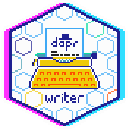

# Dapr blog posts

This file contains links to Dapr blog posts written by community members. This file is used to award community members with a [Dapr Writer digital badge](https://www.holopin.io/sticker/clt3emu6c189400fjtk3prlisi).

## Adding your Dapr blog post

1. [Fork this repository](https://github.com/dapr/community/fork).
2. Add a new row to the table below with your name, GitHub handle, and a markdown link to your Dapr blog post.
3. **Ensure to sign-off your commit**, see [Developer Certificate of Origin (DCO)](https://docs.dapr.io/contributing/contributing-overview/#developer-certificate-of-origin-signing-your-work) in the Dapr docs.
4. Create a pull request to [dapr/community](https://github.com/dapr/community) with the updated table.
5. One of the Dapr community managers will check your blog post, merge your PR, and reward you with a [Dapr Writer badge](https://www.holopin.io/sticker/clt3emu6c189400fjtk3prlisi).

| Name            | GitHub handle | Title & link                                                                                                          |
| --------------- | ------------- | --------------------------------------------------------------------------------------------------------------------- |
| Marc Duiker     | @marcduiker   | [Creating the Dapr game](https://marcduiker.dev/articles/dapr-game)                                                   |
| Nico Vermeir    | @nicovermeir  | [Getting started with the Dapr .NET SDK](https://nicovermeir.be/dapr/2024/04/03/dapr-dotnet-sdk-getting-started.html) |
| Eduard Keilholz | @nikneem      | [Azure Container Apps and Dapr](https://hexmaster.nl/posts/azure-container-apps-and-dapr/)                            |
| Jose M. Flores  | @jmfloreszazo | [Dapr Workflows](https://jmfloreszazo.com/dapr-workflows/)                                                            |
| Jose M. Flores  | @jmfloreszazo | [Dapr Tip 1#: POCO to Protobuff](https://jmfloreszazo.com/dapr-tip-1-poco-to-protobuff/)                              |
| Jose M. Flores  | @jmfloreszazo | [Dapr Middleware](https://jmfloreszazo.com/net-6-dapr-middlewares/)                                                   |
| Jose M. Flores  | @jmfloreszazo | [.Net6 Dapr ¿gRPC o Http](https://jmfloreszazo.com/net-6-dapr-grpc-o-http/)                                           |
| Jose M. Flores  | @jmfloreszazo | [.Net6 Dapr Microservices: Metadata](https://jmfloreszazo.com/net-6-dapr-microservices-metadata/)                     |
| Jose M. Flores  | @jmfloreszazo | [.Net6 Dapr: Test de Integración Azure EventHub](https://jmfloreszazo.com/net-6-dapr-test-de-integracion-azure-eventhub/) |
| Jose M. Flores  | @jmfloreszazo | [.Net6 Dapr: Bindings](https://jmfloreszazo.com/net_dapr_microservices_bindings/)                                     |
| Jose M. Flores  | @jmfloreszazo | [.Net6 Dapr: Patron Pub/Sub](https://jmfloreszazo.com/net-6-dapr-microservices-con-patron-pub-sub/)                   |
| Jose M. Flores  | @jmfloreszazo | [.Net6 Dapr: Invocación Http](https://jmfloreszazo.com/net-6-dapr-microservices-con-invocacion-http/)                 |
| Sergio Parra Guerra  | @sparraguerra | [YARP y Dapr Creando un ApiGateway para nuestros microservicios](https://www.compartimoss.com/revistas/numero-55/yarp-y-dapr-creando-un-apigateway-para-nuestros-microservicios/) |
| Sergio Parra Guerra  | @sparraguerra | [Integrando tu Azure Notification Hub con Dapr (Http Output Binding)](https://www.compartimoss.com/revistas/numero-56/integrando-tu-azure-notification-hub-con-dapr/) |
| Mathieu Benoit  | @mathieu-benoit | [Dapr with Score and Humanitec — Improving the Developer Experience of your Platform, on steroids!](https://medium.com/@mabenoit/dapr-with-score-and-humanitec-developer-experience-with-your-platform-on-steroids-a848f2de0a5a) |
