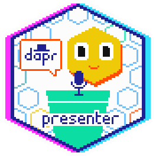

# Dapr presentations

This file contains links to Dapr presentations given by community members. This file is used to award community members with a [Dapr Presenter digital badge](https://www.holopin.io/sticker/clt3egohs11570gjnanpizv28).

## Adding your Dapr presentation

1. [Fork this repository](https://github.com/dapr/community/fork).
2. Add a new row to **the bottom** of table below with your name, GitHub handle, event name and year, and a markdown link to either:
   - a YouTube recording of the Dapr presentation
   - your (online) slide deck
   - an event page with session details
   - a blog post that shows you spoke about Dapr at an event.
3. **Ensure to sign-off your commit**, see [Developer Certificate of Origin (DCO)](https://docs.dapr.io/contributing/contributing-overview/#developer-certificate-of-origin-signing-your-work) in the Dapr docs.
4. Create a pull request to [dapr/community](https://github.com/dapr/community) with the updated table.
5. One of the Dapr community managers will check your PR, merge it, and reward you with a [Dapr Presenter badge](https://www.holopin.io/sticker/clt3egohs11570gjnanpizv28).

| Name               | GitHub handle | Event & Year                                    | Title & link                                                                                                                                      |
| ------------------ | ------------- |-------------------------------------------------| ------------------------------------------------------------------------------------------------------------------------------------------------- |
| Walter Silvestre Coan | @waltercoan   | SouJava - Java User Group - 2025 - Brazil | [Simplificando o desenvolvimento de microsserviços com o Dapr](https://github.com/waltercoan/soujava2025-dapr) [📺](https://www.youtube.com/live/CT_yrYaQoKI?si=Po9fN0pq5sYSiMjp&t=12048) |
| Walter Silvestre Coan | @waltercoan   | The Developers Conference TDC 2025 - Florianópolis/SC - Brazil | [Integrando Microservices ao LLM com o Dapr](https://github.com/waltercoan/tdcfloripa2025-dapr-conversation)  |
| Walter Silvestre Coan | @waltercoan   | devTEC 2025 - Tubarão/SC - Brazil               | [Building cloud native applications with Dapr](https://github.com/waltercoan/devtec2025-dapr-cncf-app) [📺](https://www.youtube.com/watch?v=Wb-5k_BSwmQ)          |
| Roberto Rodriguez | @Cyb3rWard0g | Dapr Day 2024                                   | [Floki: Building Agentic Workflows with Dapr](https://www.canva.com/design/DAGTv8zBp5o/3x_pWYjjncCgIJbeCKahmA/edit?utm_content=DAGTv8zBp5o&utm_campaign=designshare&utm_medium=link2&utm_source=sharebutton)
| Fernando Rocha    | @rochabr   | CNCF Vancoucer 2024                             | [Building secure and reliable distributed applications with Dapr](https://community.cncf.io/events/details/cncf-vancouver-presents-2024-cloud-native-vancouver-kickoff/) |
| Walter Silvestre Coan | @waltercoan   | The Developer's Conference 2024 - Florianópolis | [How Dapr (Distributed Application Runtime) can simplify application development in microservices](https://github.com/waltercoan/tdcflorianopolis2024-dapr)          |
| Marc Duiker        | @marcduiker   | CloudBrew 2023                                  | [Lights, Camera, Action! Building distributed applications with Dapr Actors](https://marcduiker.dev/articles/speaking-at-cloudbrew-2023)          |
| Florian van Dillen | @fvandillen   | Futuretech 2024                                 | [Dapr and .NET Aspire: A royal wedding](https://fvandillen.github.io/posts/speaking-at-futuretech-2024/)                                          |
| Eduard Keilholz    | @nikneem      | Futuretech 2024                                 | [Microservices Orchestration with Azure Container Apps](https://sessionize.com/s/eduard/microservices-orchestration-with-azure-container-a/87011) |
| Jose M. Flores     | @jmflorezzazo | MicUp 2022                                      | [Arquitectura de servicios con DAPR](https://jmfloreszazo.com/arquitectura-de-servicios-con-dapr/) |
| Sergio Parra Guerra | @sparraguerra | Netcoreconf 2023 Málaga                         | [El amigo YARP y su colega Dapr, de fiesta por las Azure Container Apps.](https://speakerdeck.com/sparraguerra/netcoreconf-2023-malaga-el-amigo-yarp-y-su-colega-dapr-de-fiesta-por-las-azure-container-apps/) |
| Sergio Parra Guerra | @sparraguerra | Netcoreconf 2023 Madrid                         | [Netcoreconf 2023 Madrid: Azure Durable Functions vs Dapr Workflows, the fight begins.](https://speakerdeck.com/sparraguerra/netcoreconf-2023-madrid-azure-durable-functions-vs-dapr-workflows-the-fight-begins/) |
| Laurent Kempé      | @laurentkempe | DevApps Meetup May 2021                         | [Présentation de Dapr, Distributed Application Runtime](https://youtu.be/Xz91tq6NI2g?t=890) (French)                                                                    |
| Laurent Kempé      | @laurentkempe | DevApps Meetup June 2021                        | [Présentation de Dapr, Distributed Application Runtime, .NET SDK](https://www.youtube.com/watch?v=XtASb2tmo5c&t=119s&ab_channel=DevApps) (French)                       |
| Christophe Gigax      | @christophegigax | DevCon #3 2022                                  | [Façonner les architectures du futur avec Dapr](https://www.youtube.com/watch?v=PRbcJDlLMQI) (French)                       |
| Christophe Gigax      | @christophegigax | Cloud Nord 2023                                 | [Façonner les architectures du futur avec Dapr](https://www.youtube.com/watch?v=bjkW2MnBCwg) (French)                       |
| Mathieu Benoit  | @mathieu-benoit | Dapr Community Call - Jan 10th (#96)            | [Dapr + Score + Humanitec demo](https://www.youtube.com/watch?v=4gT0Y6QxinU&t=140s) |
| Mathieu Benoit  | @mathieu-benoit | PlatformCon 2024                                | [Dapr + Score: Crafting and improving your developers experience](https://platformcon.com/talks/dapr-score-crafting-and-improving-your-developers-experience) |
| Whit Waldo | @whitwaldo | Dapr Day - Fall 2024                            | [Building Real-World Applications with Dapr: A Developer's Journey](https://www.youtube.com/live/9pjpDmIT-S0?si=iV8adLOeUkNNNXSH&t=13489) |
| Harry Kimpel | @harrykimpel | Dapr Day - Fall 2024                            | [Dapr and .NET Aspire – A New Era for Observability](https://youtu.be/9pjpDmIT-S0?t=8890) |
| Whit Waldo | @whitwaldo | AppDeveloperCon NA 2024                         | [Building Real-World Applications with Dapr: A Startup Developer's Journey](https://www.youtube.com/watch?v=w2DWTZE5ilU&list=PLj6h78yzYM2NtnoIEBYp6Kw1y1P2WaixQ&index=8) 
| Marc Klefter | @marcklefter | NDC Oslo 2024                                   | [Dapr in Practice](https://www.youtube.com/watch?v=h96cj2DOZVE)
| Manuel Zapf | @SantoDE | KCD Denkmark 2024                               | [A Deep Dive into Cilium and Dapr Integration](https://www.youtube.com/watch?v=8_69ub3deD8)
| Walter Silvestre Coan | @waltercoan | Microsoft Reactor São Paulo                     | [Connecting PLC using Modbus and Dapr to Azure IoT Operations](https://www.youtube.com/watch?v=77kdnWY5Mck) 
| William Liebenberg | @william-liebenberg | Azure Builders Melbourne 2025                   | [Dapr Transactional Outbox with ASP.NET applications](https://www.linkedin.com/posts/william-liebenberg_dapr-aspire-activity-7310259210594697216-QGK9)
| Siri Varma Vegiraju | @siri-varma | Dapr Day - Fall 2024                            | [Processing one million data points daily with Dapr](https://www.diagrid.io/videos/dapr-day-processing-one-million-data-points-daily-with-dapr)
| Siri Varma Vegiraju | @siri-varma | Conf42 - Cloud Native                           | [Enhancing Workflow Reliability with Dapr](https://www.conf42.com/Cloud_Native_2025_Siri_Varma_Vegiraju_workflow_dapr_failure)
| Carlos Mendible | @cmendible | Netcoreconf - February 2021 | [Extending Azure Functions with Dapr](https://carlos.mendible.com/events/2021/02/27/virtual_net_core_conf/) (Spanish) |
| Carlos Mendible | @cmendible | KCD Spain - June 2021 | [Event driven Microservices with Dapr and .NET](https://carlos.mendible.com/events/2021/05/18/kcd-spain-dapr/) (Spanish) |
| Carlos Mendible | @cmendible | dotNET Spain - June 2021 | [Event driven Microservices with Dapr and .NET](https://carlos.mendible.com/events/2021/06/22/dotnet2021/) (Spanish) |
| Carlos Mendible | @cmendible | dotNET Spain - June 2024 | [Interactuando con la IA en el mundo real](https://carlos.mendible.com/events/2024/06/02/interactuando-ia-mundo-real/) (Spanish) |
| Whit Waldo | @whitwaldo | KCD Texas - May 2025 | [Harnessing Dapr Actors: Building Scalable Applications with Confidence](https://www.youtube.com/watch?v=mudomMIU4qM&list=PL4UW_RgvzVchEiE5b6GnVQP2paAKYIIu1&index=9) |